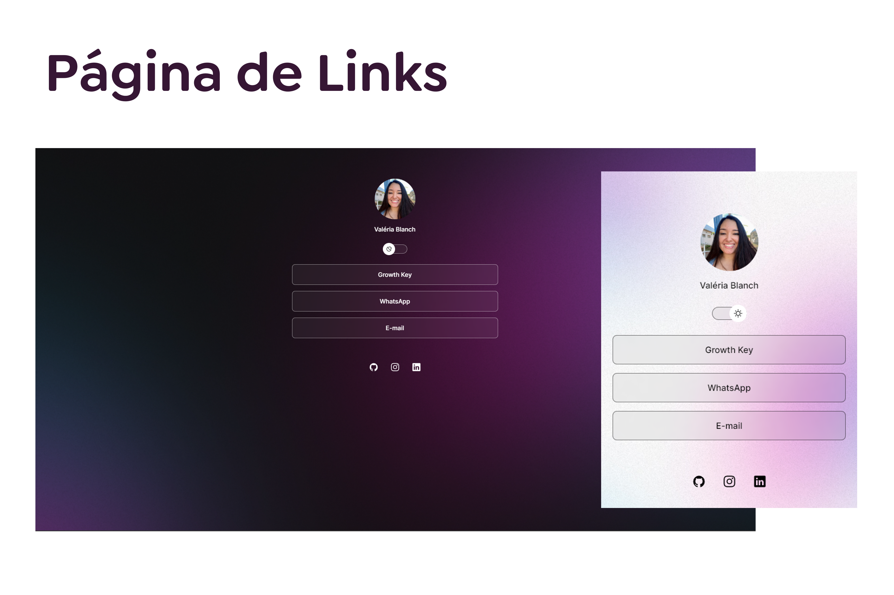

<h1 align="center"> Projeto Página de Links </h1>

  <a href="#-tecnologias">Tecnologias</a>&nbsp;&nbsp;&nbsp;|&nbsp;&nbsp;&nbsp;
  <a href="#-projeto">Projeto</a>&nbsp;&nbsp;&nbsp;|&nbsp;&nbsp;&nbsp;
  <a href="#memo-licença">Licença</a>

  

 

  

## Tecnologias

EsTe projeto foi desenvolvido com as seguintes tecnologias:

- HTML e CSS
- JavaScript
- Git e Github

## Projeto

O projeto é um agregador de links para usar como cartão de visitas online.

 [Clique aqui para acessar o projeto finalizado!](https://valeriablanch.github.io/projeto_links)

## Licença

Este projeto está sob a licença MIT.